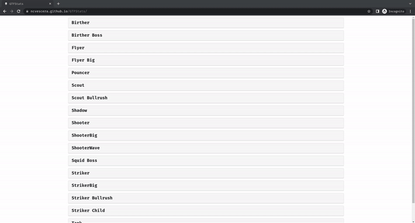

# GTFStats

Web Interface for GTFO The Game EnemyBalancingDataBlock stats.

> This UI is based on `EnemyBalancingDataBlock` provided by [UntiIted/OriginalDataBlocks](https://github.com/UntiIted/OriginalDataBlocks)

## UI features 🚀



You can see all the enemy names, click on them to reveal their stats (reclick to hide). Stats are organized in 4 categories:

- **Health**: stats like MaxHealth, Health Damage Multiplier, ecc
- **Damage**: damage dealt with melee or ranged attacks
- **Collision**: collision range with player, can be pushed, ecc
- **C-Foam**: c-foam (glue) resistance and fadeout time

## Build ⚙️

Clone the repo in your local machine:

```bash
git clone https://github.com/ncvescera/GTFStats.git
cd GTFStats
```

Then install the required packages with:

```bash
yarn install
```

Now you can build the project or just run it:

```bash
# build
yarn build

# run
yarn serve
```

The `publish.sh` script will create a new branch and push the content of `dist` (the folder generated with the command `yarn build`) in `origin/gh-pages`. This is useful if you have a GitHub-Page environment set up in the remote repo. You can run it with:

```bash
./publish.sh
# or
yarn ghpages
```
